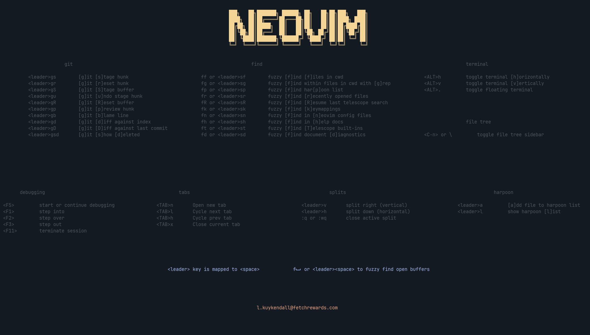

# nvim.config

<!-- START doctoc generated TOC please keep comment here to allow auto update -->
<!-- DON'T EDIT THIS SECTION, INSTEAD RE-RUN doctoc TO UPDATE -->
- [Introduction](#introduction)
- [Installation](#installation)
  - [Install Neovim](#install-neovim)
  - [Install External Dependencies](#install-external-dependencies)
  - [Setup your neovim config](#setup-your-neovim-config)
    - [Recommended Step](#recommended-step)
    - [Clone the repo](#clone-the-repo)
- [Post-Install](#post-install)
- [Learning keymaps](#learning-keymaps)
- [Changing the color scheme](#changing-the-color-scheme)
- [Important Plugins](#important-plugins)
  - [LSP Config](#lsp-config)
  - [Mason](#mason)
  - [Telescope](#telescope)
    - [Telescope keymaps](#telescope-keymaps)
  - [nvim-cmp (Autocomplete)](#nvim-cmp-autocomplete)
  - [Treesitter](#treesitter)
  - [Dadbod (SQL UI)](#dadbod-sql-ui)
- [Debugging](#debugging)
- [Plugins requiring additional configuration](#plugins-requiring-additional-configuration)
  - [TagBar](#tagbar)
  - [Codeium](#codeium)
  - [Pyright (Python LSP) Virtual Env Configuration](#pyright-python-lsp-virtual-env-configuration)

<!-- END doctoc generated TOC please keep comment here to allow auto update -->


## Introduction

This is my neovim configuration. It is based on a fork of [nvim-lua/kickstart.nvim](https://github.com/nvim-lua/kickstart.nvim)
called [kickstart-modular.nvim](https://github.com/dam9000/kickstart-modular.nvim).


<p style="text-align: center;">*Landing page*</p>

## Installation

### Install Neovim

Install the latest stable version of [neovim](https://github.com/neovim/neovim).
I prefer to [build from source](https://github.com/neovim/neovim/blob/master/BUILD.md).

### Install External Dependencies

External Requirements:

- Basic utils: `git`, `make`, `unzip`, C Compiler (`gcc`)
  - If you built from source, the first step had you install these build requisites
- [ripgrep](https://github.com/BurntSushi/ripgrep#installation)
- Clipboard tool (xclip/xsel/win32yank or other depending on platform)
  - Linux/Mac will most likely already have one of these installed
- A [Nerd Font](https://www.nerdfonts.com/): optional, provides various icons
  - if you have it set `vim.g.have_nerd_font` in `init.lua` to true
- Language Setup:
  - If want to write Golang, you will need `go`
  - etc.

### Setup your neovim config

Neovim's configurations are located under the following paths,
depending on your OS:

|          OS         |                 PATH                      |
| :-                  | :---                                      |
| Linux, MacOS        | `$XDG_CONFIG_HOME/nvim`, `~/.config/nvim` |
| Windows (cmd)       | `%localappdata%\nvim\`                    |
| Windows (powershell)| `$env:LOCALAPPDATA\nvim\`                 |

#### Recommended Step

[Fork](https://docs.github.com/en/get-started/quickstart/fork-a-repo) this repo
so that you have your own copy that you can modify, then install by cloning the
fork to your machine using one of the commands below, depending on your OS.

> **NOTE**
> Your fork's url will be something like this:
> `https://github.com/<your_github_username>/config.nvim.git`

#### Clone the repo

This command will clone the repo to your `~/.config/nvim` folder:

```sh
git clone git@github.com:lylekuykendall/nvim.config.git "${XDG_CONFIG_HOME:-$HOME/.config}"/nvim
```

Alternatively, you may wish to clone the repo elsewhere and create a symlink to
`~/.config/nvim` as follows:

```sh
git clone git@github.com:lylekuykendall/nvim.config.git \
&& sudo ln -s /path/to/cloned/repo ~/.config/nvim
```

## Post-Install

Start Neovim

```sh
nvim
```

Lazy will install all the default plugins the first time you open neovim.
It will also automatically install any new plugins you create files for in
the `plugins` folder. `lazy-bootstrap.lua` is the file that bootstraps the
initial install of the config, and `lazy-plugins.lua` is responsible for
installing the plugins defined in the `plugins` folder.

## Learning keymaps

By default, `<space>` is the leader key. When you see `<leader>` in keymappings,
it refers to the leader key. Leader key can be changed by updating these two lines
in `init.lua`

```lua
vim.g.mapleader = ' '
vim.g.maplocalleader = ' '
```

These files have most of the keymaps and options being used:

- `options.lua` for global neovim options
- `keymaps.lua` for global neovim keymaps
- `telescope.lua` for telescope-specific (fuzzy file search & more) keymaps

Note: The keymaps above also work in normal mode without `<leader>`.
IE, while in normal mode, `sf` will open the fuzzy file search, etc.

## Changing the color scheme

There are a variety of bundled themes. Try `<leader>tc` or
`:Telescope colorscheme` to open a picker and preview window.

## Important Plugins

Use `:Lazy` to view status for all installed plugins. Hit `q` to close the window.

### LSP Config

[nvim-lspconfig](https://github.com/neovim/nvim-lspconfig) is used for
configuring LSP (language server protocol) in neovim. There are several
language servers installed by default using Mason (see `:h Mason`). You can add
additional servers to the `ensure_installed` table on line 221 of
`lspconfig.lua` and Mason will install them automatically the next
time you start Neovim.

### Mason

Mason is a package manager for neovim plugins. This repo uses Mason,
mason-lspconfig, and mason-tool-installer to handle automatically installing
and setting up language servers. The configuration for each of these plugins
can be viewed in `lspconfig.lua`. See [available servers](https://github.com/williamboman/mason-lspconfig.nvim?tab=readme-ov-file#available-lsp-servers)
for additional server options, or type `:Mason` to open a browsable UI.

### Telescope

Telescope is a fuzzy finder for neovim. It has options for fuzzy finding a
variety of items, the list below is only a small selection. Telescope is
configured in `telescope.lua`.

#### Telescope keymaps

- `<leader>sf` for fuzzy file search
- `<leader>sn` for fuzzy file search within neovim config files
- `<leader>sg` for fuzzy grep for text
- `<leader>sw` for fuzzy grep for word under cursor
- `<leader>sk` for fuzzy keymap search
- `<leader>ss` for fuzzy searching Telescope's commands
  - You can assign keymaps for any of the options in this menu

### nvim-cmp (Autocomplete)

[nvim-cmp](https://github.com/hrsh7th/nvim-cmp) is a completion engine for neovim.
It provides auto-complete suggestions based on the cmp sources that have been
installed and configured. These plugins are installed and configured in `cmp.lua`.
If you want AI completion suggestions, you will need to configure `codeium.nvim`.
See section below for more detail.

### Treesitter

[nvim-treesitter](https://github.com/nvim-treesitter/nvim-treesitter) enables
syntax highlighting for a variety of languages, as well as other language parsing
capabilites. Default languages are listed in `ensure_installed` on line 6 of
`treesitte.lua`. You can add additional languages here to be installed automatically,
or run `TSInstall <language>` manually.

### Dadbod (SQL UI)

[vim-dadbod](https://github.com/tpope/vim-dadbod) provides a UI for running SQL
queries against relational databases directly in neovim. Might be able to put
together a Snowflake adapter based on [this PR](https://github.com/tpope/vim-dadbod/pull/65).

## Debugging

This configuration uses [nvim-dap](https://github.com/mfussenegger/nvim-dap) and
[nvim-dap-ui](https://github.com/rcarriga/nvim-dap-ui) to provide an out-of-the-box
debugging experience that is automatically configured for both python and golang.

You can set a breakpoint with `<leader>b`, and begin debugging with `<F5>`. The basic
debugging keymaps are set in `debug.lua` and are as follows:

- `<F5>`: Start/Continue debugging
- `<F1>`: Step Into
- `<F2>`: Step Over
- `<F3>`: Step Out
- `<F11>`: Terminate debugging session, close ui

Golang has some additional debugging keymaps thanks to [nvim-dap-go](https://github.com/leoluz/nvim-dap-go/tree/main):

- `<leader>dgt`: Debug go test under cursor
- `<leader>dlt`: Debug last test (rerun last debug session)

`nvim-dap-go` also has support for build flags and command line arguments. You should
see these options after pressing `<F5>` to begin a debug session. For more information,
see the [docs](https://github.com/leoluz/nvim-dap-go/blob/main/README.md#debugging-with-command-line-arguments).

When the debug ui is visible, you can jump between the various windows
with `<C-hjkl>` (`CTRL+hjkl`).

## Plugins requiring additional configuration

### TagBar

Tagbar is a sidebar you can toggle open/closed with `<F8>`. It requires that you
have [ctags](https://github.com/universal-ctags/ctags?tab=readme-ov-file#how-to-build-and-install)
intalled and on your path.

### Codeium

[codeium.nvim](https://github.com/Exafunction/codeium.nvim) is an ai completion
tool that you can use as a source for your completion suggestions. You'll need
to run `:Codeium auth` and use the link to get an api token to give to the plugin.
Next, you'll need to find and uncomment the two locations in this config where
codeium can be used as a source. Try `sg` or `<leader>sg` and grepping for
`codeium` to find these lines.

### Pyright (Python LSP) Virtual Env Configuration

Getting pyright to recognize the correct virtual environment to use for its
interpreter can be tricky. If you use [pyenv](https://github.com/pyenv/pyenv)
for managing your virtual environments, you can configure pyright at a per-project
level using a pyenv plugin called [pyenv-pyright](https://github.com/alefpereira/pyenv-pyright).
